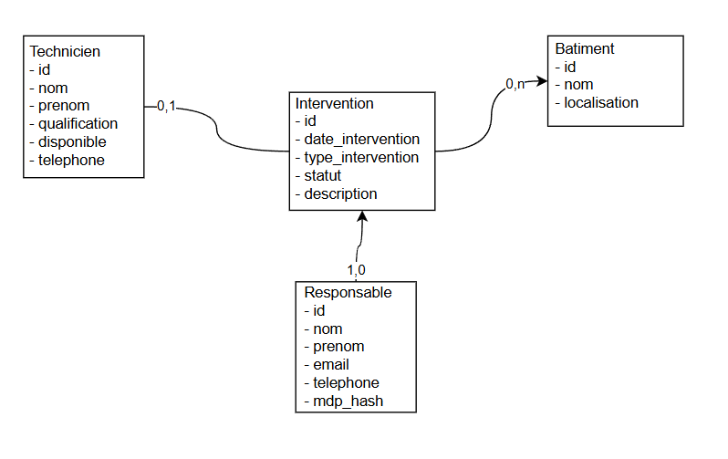

# Projet Java ISN – Application de Gestion de Maintenance

## Informations générales

**UE :** Programmation Avancée – Java / Base de données  
**Formation :** Master ISN  

**Projet réalisé par :**
- Cheikh Mbake Seye  
- Ismail EL YOUSFI  
- Oualid CHAREF  

Ce document sert à la fois :
- de **documentation technique**
- de **guide de reproduction**
- de **journal d’avancement du projet**

Il est destiné à tous les membres du groupe ainsi qu’au professeur.

---

## Présentation générale

Ce projet est une application desktop développée en Java dans le cadre d’un projet
de programmation avancée avec base de données.

L’objectif est de gérer des interventions de maintenance sur des bâtiments,
en impliquant des techniciens et un responsable authentifié.

L’application repose sur :
- JavaFX pour l’interface graphique
- Hibernate ORM pour la persistance
- MariaDB pour la base de données
- Maven pour la gestion du projet

---

## Modèle conceptuel de données

Le modèle conceptuel de données (MCD) décrit les entités principales et leurs relations :
- Responsable
- Technicien
- Bâtiment
- Intervention

Le schéma MCD est disponible dans le projet : <br />


---

## Architecture et organisation du code

Le projet suit une architecture en couches afin de séparer les responsabilités.

Projet<br />
├── java/<br />
│ ├── app/<br />
│ │ └── MainApp.java<br />
│ ├── controller/<br />
│ │ └── *Controller.java<br />
│ ├── dao/<br />
│ │ └── *DAO.java<br />
│ ├── model/<br />
│ │ └── Entités Hibernate<br />
│ └── util/<br />
│ └── HibernateUtil, PasswordHash<br />
│<br />
├── resources/<br />
│ ├── views/<br />
│ │ └── *.fxml<br />
│ └── hibernate.cfg.xml<br />
│<br />
├── sql/<br />
│ ├── MCD.png<br />
│ └── 01_create_tables.sql<br />
│<br />
└── pom.xml<br />


---

## Choix du pattern DAO

Le projet utilise le pattern DAO (Data Access Object).

Ce choix permet :
- de séparer la logique métier de l’accès aux données
- d’isoler Hibernate du reste de l’application
- de centraliser les opérations CRUD
- de faciliter la maintenance et l’évolution du code

Les contrôleurs JavaFX n’accèdent jamais directement à Hibernate.
Toute interaction avec la base passe par les classes DAO.

---

## Création de la base de données et des tables

Les tables sont définies dans un fichier SQL versionné dans le projet à executer :

sql/01_create_tables.sql 


Ce fichier contient l’ensemble des instructions CREATE TABLE correspondant
au modèle de données.

---

## Interface phpMyAdmin – Accès et administration de la base de données

phpMyAdmin est l’interface graphique utilisée dans ce projet pour administrer
la base de données MariaDB pendant la phase de développement.

Elle permet de visualiser la structure de la base, de vérifier la création
des tables et de gérer les données plus facilement.

---

### Accès à l’interface phpMyAdmin

Une fois Docker démarré, l’interface phpMyAdmin est accessible depuis
un navigateur web à l’adresse suivante : http://localhost:8080

Cette adresse est définie dans le fichier `docker-compose.yml`
via la configuration des ports.

- `localhost` correspond à la machine locale
- chaque membre du projet accède à phpMyAdmin sur sa propre machine

---

### Connexion à phpMyAdmin

Sur l’écran de connexion phpMyAdmin, les informations suivantes doivent être saisies.

Serveur : db


Les identifiants de connexion sont définis directement dans le fichier
`docker-compose.yml`.

Connexion administrateur :
- Utilisateur : root
- Mot de passe : root

Connexion applicative :
- Utilisateur : app
- Mot de passe : app

Ces comptes sont utilisés uniquement dans le cadre du développement.

---

## Authentification – Compte de test

Un utilisateur de test est disponible pour se connecter à l’application.

- Email : admin@maintenance.local
- Mot de passe : admin123

Le mot de passe est stocké en base sous forme de hash MD5.

L’utilisateur connecté est conservé en mémoire dans l’application
afin d’être utilisé lors des opérations (création d’interventions, etc.).

---

## Lancement de l’application

Après avoir démarré Docker et vérifié la base de données, l’application
peut être lancée avec Maven :

```bash
mvn javafx:run
```
